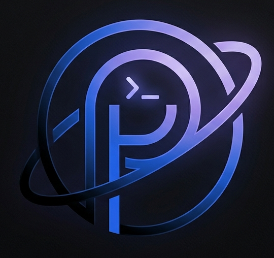
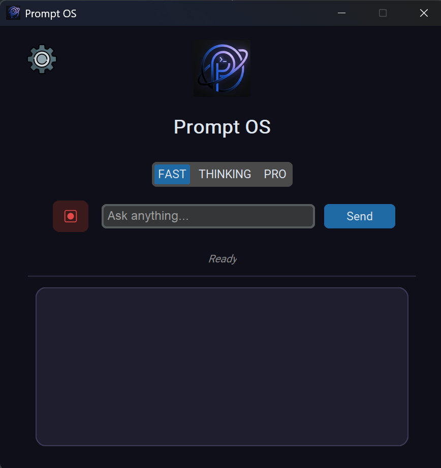
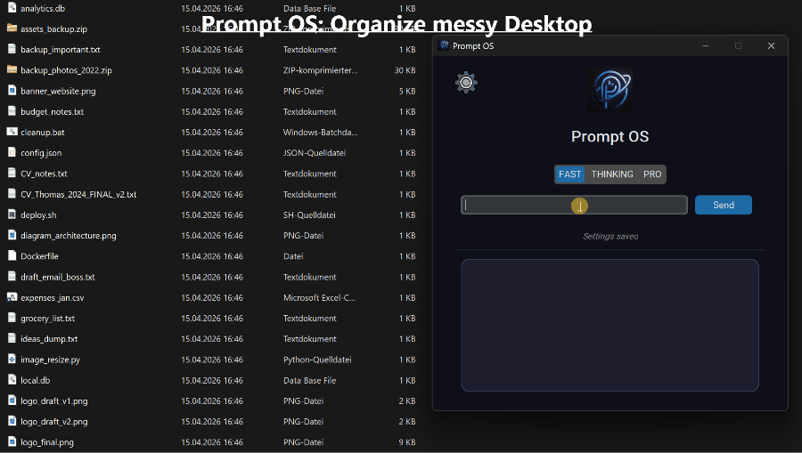

# 🖥️ Prompt OS

<p align="center">
  
</p>

<!-- The icon.png used to be here, but assets/logo.png is already used as a logo -->


[](https://github.com/thomastschinkel/prompt-os/releases)

**Prompt OS** is a powerful, desktop-based AI agent built in Python. Unlike a simple chatbot, it acts as a true system agent — it can execute terminal commands, manage your files, run code, search the web, and more, all from a sleek local GUI.

> "What processes are using the most memory?" → it runs the command and tells you.
> "Rename all images in my Downloads folder" → it writes and runs the script.

---

<p align="center">
  
</p>

---

## ✨ Why Prompt OS?

Most AI assistants just *talk*. Prompt OS *acts*. It runs iteratively — thinking, using tools, reading outputs, and refining — until your task is actually done.

---

## 🚀 Features
  
- **Autonomous Browser Control** — Uses `browser-use` to navigate the web, fill forms, and extract information just like a human.
- **Vision & Screenshot Interpretation** — Captures the current screen and uses advanced multimodal models (`INTERPRET_SCREENSHOT`) to describe windows, apps, and layouts in extreme detail.
- **System Clipboard Manager** — The agent can read from and write to your system clipboard (`CLIPBOARD_MANAGER`) to help you transfer data between applications flawlessly.
- **Native Document Parser** — Supports reading and extracting clean text from PDF, DOCX, XLSX, CSV, and HTML files autonomously (`READ_FILE`).
- **Local System Control** — Executes terminal commands (`CMD`), manages files (`FILE_HANDLER`), and runs Python snippets (`EXEC_PY`) autonomously.
- **Smart Modes** — Choose between **FAST** (efficiency), **THINKING** (deep reasoning), and **PRO** (advanced tasks) directly in settings.
- **Multi-Provider LLM Support** — Switch between GitHubAI, Groq, OpenRouter, Unclose, Anthropic, OpenAI, and Google right from the GUI settings.
- **Web Search & Scraping** — The agent autonomously queries DuckDuckGo (`SEARCH_WEB`) and extracts clean text from webpages (`READ_EFF_HTML`).
- **Persistent Memory** — Stores long-term preferences and context in `config/memory.txt`, injected automatically into every session.
- **Modern Dark UI** — Sleek, responsive desktop interface built with `customtkinter` featuring an in-app Settings menu for models and API keys.

---

## ⚙️ Prerequisites

- Python 3.10+
- An active internet connection for API services
- API keys for one or more supported LLM providers

---

## 🛠️ Installation

**1. Clone the repository:**
```bash
git clone https://github.com/thomastschinkel/prompt-os.git
cd prompt-os
```

**2. Install dependencies:**
```bash
pip install -r requirements.txt
```

**3. Configure API keys:**

Launch the app (`python main.py`) and click the **Settings** gear icon (⚙️) at the top left. Select your desired provider, pick a model, and choose your preferred **Mode** (FAST, THINKING, or PRO).

Type or paste your API key directly into the secure input box. Click **Save** to update `config/keys.json` and `config/settings.json`.

> The built-in **Unclose** and **Google (Gemini)** providers work for free.

---

## 💡 Usage

```bash
python main.py
```

| Step | Action |
|---|---|
| **1. Pick a model** | Click the ⚙️ icon to select your LLM provider and default model, enter the API key, and click **Save** |
| **2. Type a request** | e.g. *"What's eating my CPU right now?"* or *"Create a script to organize my Desktop"* |
| **3. Watch it work** | The agent thinks iteratively, uses tools, and streams updates in real time |

---

<p align="center">
  
</p>

---

## 📁 Project Structure

```
prompt-os/
├── main.py               # Entry point, UI layer, and tool execution loop
├── src/                  # Core application logic
│   ├── ai.py             # LLM engine, conversation history, API integrations, and Browser-Use setup
│   └── utils.py          # Web search, audio recording, terminal output helpers
├── assets/               # Images, icons, and static UI assets
└── config/               # Configuration and memory files
    ├── keys.json         # API key configuration
    ├── settings.json     # App state (provider, model, mode)
    ├── memory.txt        # Persistent long-term memory
    └── prompt.txt        # System instructions defining agent behavior
```

---

## 🤖 Supported Providers

| Provider | Model | Free? | Requires Key? |
|---|---|---|---|
| **Google** | Gemini 3.1 Pro/Flash | ✅ (free tier) | Yes |
| **GitHubAI** | GPT-4o Mini / Phi-4 / Llama-3.3 | ✅ (with GitHub account) | Yes |
| **Groq** | LLaMA 3.3 70B / Qwen | ✅ (free tier) | Yes |
| **OpenRoute** | Qwen 3.6+ / Kimi / Claude | ✅ (free tier) | Yes |
| **Unclose** | DeepSeek R1 14B / Qwen3-VL | ✅ Completely free | No |
| **Anthropic** | Claude 4.5/4.6 Family | ❌ Paid API | Yes |
| **OpenAI** | GPT-4o / GPT-5 | ❌ Paid API | Yes |

---

## 📜 License

Distributed under the [MIT License](LICENSE).

---

## 🙌 Contributing

Contributions, issues, and feature requests are welcome! Feel free to open an issue or submit a pull request.

If you find this project useful, consider giving it a ⭐ — it helps a lot!
